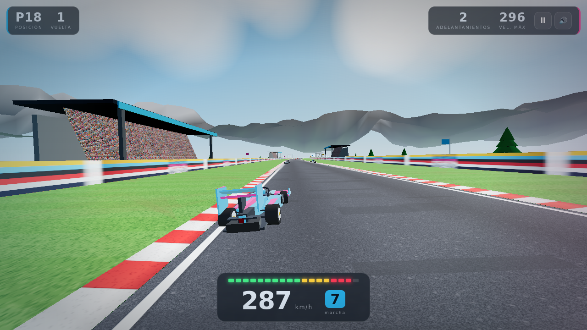

# Gran Premio 3D

Juego de carreras de Fórmula 1 en 3D hecho con **Three.js**, sin frameworks ni
build: son archivos estáticos que se abren en cualquier navegador y también se
empaquetan como **APK de Android**.



## El juego

- Monoplaza del jugador inspirado en el Alpine: **celeste con detalles rosas**,
  piloto visible con casco, visor, halo, brazos y volante.
- Rivales en **rojo, negro y plateado**. Arrancás último (P20) y sumás
  posiciones cada vez que pasás a uno.
- Pista con asfalto texturizado, pianos en relieve, **pasto a los costados**,
  vallas publicitarias y **tribunas con público a lo lejos**.
- Fondo panorámico: cielo con sol y nubes + **cordillera 3D generada por
  ruido fractal** (no es una imagen plana). Como la pista serpentea, el
  panorama se mueve de lado a lado mientras se va hacia adelante.
- Pórtico de meta a cuadros cada 3 km: ahí se suma una vuelta.
- Detalles en movimiento: peralte en las curvas, polvo al pisar el pasto,
  humo de gomas al frenar fuerte, luz de freno, chispazo en los contactos y
  cierre de cámara al superar los 180 km/h.

### Controles

| Acción | Teclado | Joystick | Celular |
| --- | --- | --- | --- |
| Acelerar | `↑` / `W` | gatillo derecho o `A` | botón GAS |
| Frenar | `↓` / `S` / espacio | gatillo izquierdo o `B` | botón FRENO |
| Doblar | `←` `→` / `A` `D` | palanca izquierda (analógico) | flechas **o** arrastrar el dedo |
| Pausa | `P` / `Esc` | Start | botón `II` |
| Reiniciar | `R` | — | — |
| Sonido | `M` | — | botón 🔊 |

La dirección es progresiva y vuelve sola al centro; a alta velocidad responde
menos, como un auto real. Si te vas al pasto perdés agarre y velocidad, y en
los pianos el auto vibra pero todavía dobla. En las curvas la pista tiene
peralte: ayuda, pero igual hay que contravolantear porque cuanto más rápido
vas, más te empuja hacia afuera.

## Correrlo en la compu

No necesita instalar nada, pero conviene servirlo por HTTP:

```bash
python3 -m http.server 8000
# abrir http://localhost:8000/index.html
```

Se puede forzar la calidad con `?q=high` o `?q=low` (por defecto: alta en
escritorio, baja en celulares).

También es una PWA: desde Chrome en Android se puede "Instalar app" y queda
jugable sin conexión.

## APK de Android

El APK es la misma web corriendo en un `WebView` a pantalla completa, en
horizontal y con aceleración por hardware (`android/`). El juego se copia solo
a los assets del APK al compilar.

**Opción 1 — GitHub Actions (no requiere instalar nada):** al pushear se
ejecuta `.github/workflows/android.yml`, que compila `app-debug.apk`,
verifica que el juego haya quedado adentro y lo publica de dos formas:

- como release fijo, para bajar directo desde el celular:
  <https://github.com/ramiroarrojo2077-beep/Ax/releases/tag/apk-latest>
- como artefacto de la ejecución, en la pestaña *Actions*.

**Opción 2 — local**, con el SDK de Android instalado:

```bash
cd android
./gradlew assembleDebug
# APK en android/app/build/outputs/apk/debug/app-debug.apk
```

O abrir la carpeta `android/` con Android Studio y darle *Run*.

Para instalarlo en el teléfono hay que habilitar "instalar apps de orígenes
desconocidos" (es un APK de depuración, firmado con la clave de debug).

## Estructura

```
index.html            página del juego (HUD + pantalla de inicio)
css/style.css         interfaz: tablero, marcador, controles táctiles
js/textures.js        texturas generadas por canvas (asfalto, pasto, público…)
js/terrain.js         cordillera 3D con ruido fractal y calima horneada
js/track.js           curvatura de la pista, cintas de asfalto y decorado
js/input.js           teclado, joystick y controles táctiles
js/fx.js              partículas de polvo, humo y contactos
js/car.js             monoplaza, livery, piloto y ruedas
js/sky.js             cielo, luces, sombras y mapa de reflejos
js/game.js            física arcade, rivales, cámara, HUD y sonido
vendor/three.min.js   Three.js r152 (incluido para poder jugar sin internet)
showroom.html         página auxiliar para mirar el auto desde varios ángulos
android/              proyecto Android (WebView) para generar el APK
```
